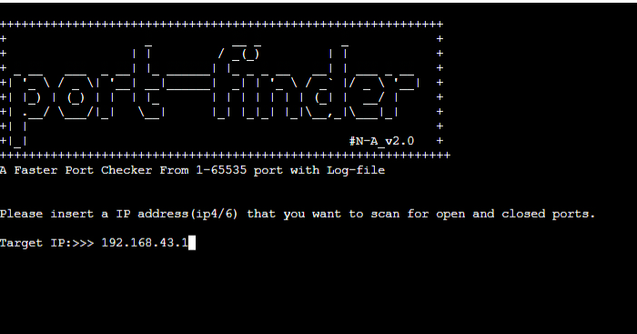

# port-finder
 
A port-Finder is an application designed to probe a server or host for open ports. Such an application may be used by administrators to verify security policies of their networks and by attackers to identify network services running on a host and exploit vulnerabilities
